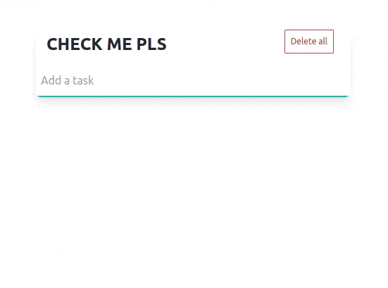

# check-me-htmx

just a simple to do list using [htmx](https://htmx.org/) + golang [echo server](https://echo.labstack.com/) + [tailwind](https://tailwindcss.com/) + sqlite

first time trying htmx, but (un)fortunately its not like front-end frameworks that i'm used to

### run

Air is configured

`air`
